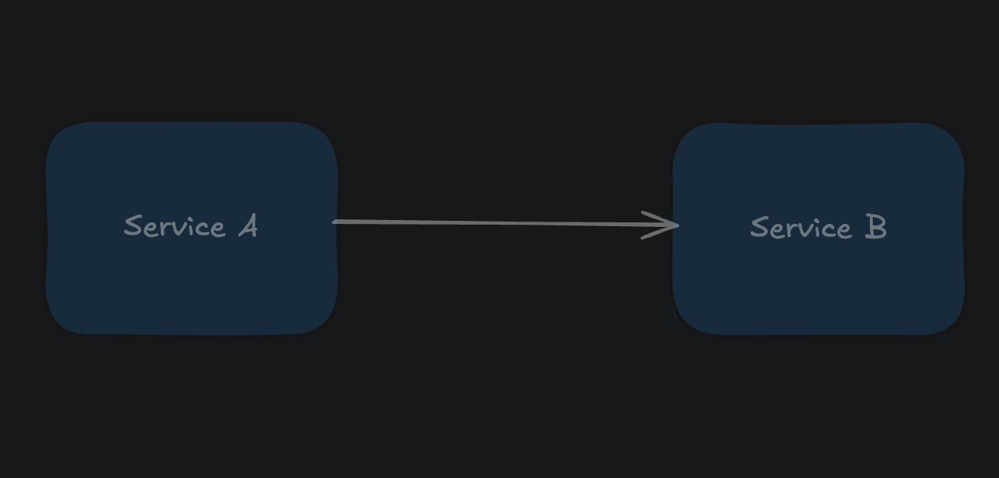
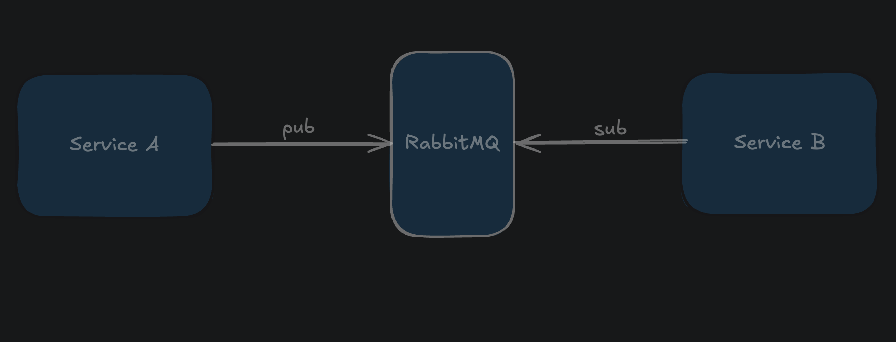
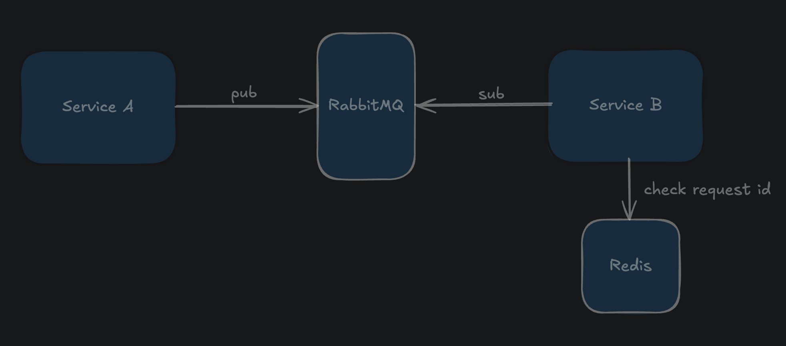
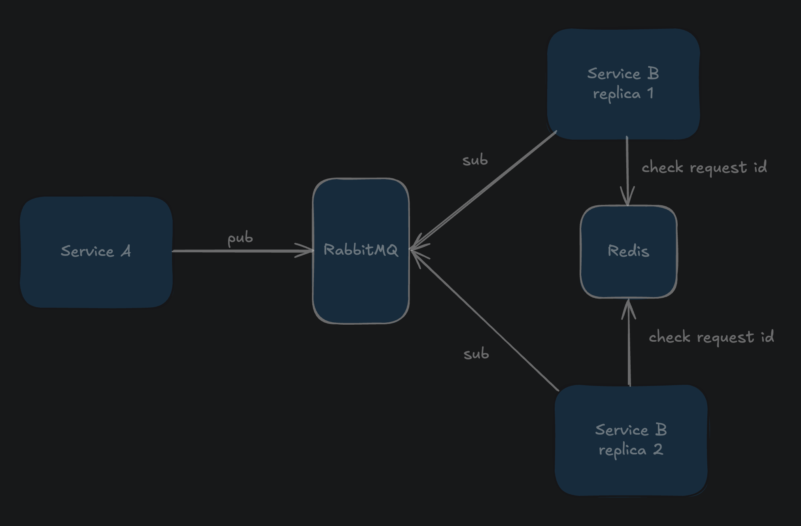

# Task 1

## Задача
Есть веб-сервис А, принимающий запросы от пользователей, запросов может приходить в час 200 000. В день приходит до 2 000 000 запросов
Сервис А должен отправить эти данные в сервис Б, чтоб обработать данные. 
Сервис Б может обработать 100 000 запросов в час. 
Запросы от пользователей поступающий в сервис А нельзя потерять.
Как бы вы организовали межсервисное взаимодействие, хранение данных, результатов, какие инструменты  использовали бы для этого?

## Решение
Разобъем задачу на несколько частей.

### Межсервисное взаимодействие и гарантия доставки

Самым простым решением, которое можно использовать для передачи данных между сервисами, подключить брокер сообщений. Дальше я буду рассматривать решение с использованием RabbitMQ. 

Кролик поддерживает разные механизмы доставки. В данном случае отлично подходит "at least once". Т.е. брокер
будет гарантировать, что сообщение будет передано как минимимум один раз. Также можно настроить RabbitMQ таким образом, чтобы он сохранял сообщения на диск. Это поможет не потерять их в случае сбоев и перезагрузке брокера.

### Дедубликация сообщений
Режим "at least once" подразумевает, что сообщение может быть доставлено более одного раза. Это может быть критичным, если запросы не идемпотентные. Для обеспечения обработки запроса только один раз можно добавить отдельную проверку перед началом. Для этого сервис А должен вместе с запросом отправлять его уникальный идентификтор. Сервис B будет проверять в хранилище, не добавлялся ли данных id в бд. Если нет, то добавит его и обработает запрос. 

В качестве хранилища идентификаторов запросов можно использовать Redis. Он также позволит установить TTL для ключа, чтобы id удалялись автоматически из бд спустя установленный промежуток времени и память не расходовалась бесконечно.

### Масштабирование сервисов
Т.к. сервис A принимает вдвое больше запросов, чем сервис Б, это будет приводить к тому, что количество необработанных запросов будет постоянно копиться. Соответственно потребление памяти будет расти.

Чтобы этого не прохсходило нужно запустить копию сервиса Б, который будет читать сообщения из той же очереди.
Сделать это можно любым оркестратором вроде Docker Swarm или Kubernetes.

Таким образом получим кластер, который не только справляется с поступающей на вход нагрузкой, но и может быть
легко масштабирован в будуще.